# Tailwind CSS

## What is Tailwind CSS?

Tailwind CSS is a **utility-first CSS framework** that lets you style elements directly in your HTML using small, single-purpose classes — instead of writing custom CSS.

With regular CSS, you write something like this:

```css
.card {
  display: flex;
  padding: 16px;
  background-color: #3b82f6;
  border-radius: 8px;
}
```

With Tailwind, you do it directly in HTML:

```html
<div class="flex p-4 bg-blue-500 rounded-lg">Card content</div>
```

No context switching between files. No naming classes. Just write and see the result instantly.

---

## What are Utility Classes?

Utility classes are **small, single-purpose CSS classes** where each class does exactly one thing.

| Class        | What it does         |
| ------------ | -------------------- |
| `flex`       | `display: flex`      |
| `p-4`        | `padding: 16px`      |
| `text-white` | `color: white`       |
| `rounded-lg` | `border-radius: 8px` |
| `font-bold`  | `font-weight: 700`   |

You combine multiple utility classes to build any UI — no custom CSS needed.

---

## Installation

### 1. Via CDN (Quick Start — No Build Tool)

Best for learning and prototyping. Just drop this in your HTML `<head>`:

```html
<script src="https://cdn.tailwindcss.com"></script>
```

Full example:

```html
<!DOCTYPE html>
<html lang="en">
  <head>
    <meta charset="UTF-8" />
    <meta name="viewport" content="width=device-width, initial-scale=1.0" />
    <title>Tailwind CSS</title>
    <script src="https://cdn.tailwindcss.com"></script>
  </head>
  <body>
    <h1 class="text-3xl font-bold text-blue-600">Hello Tailwind!</h1>
  </body>
</html>
```

### 2. Via npm (Recommended for Projects)

```bash
npm install -D tailwindcss
npx tailwindcss init
```

Configure `tailwind.config.js`:

```js
/** @type {import('tailwindcss').Config} */
module.exports = {
  content: ["./src/**/*.{html,js}"],
  theme: {
    extend: {},
  },
  plugins: [],
};
```

Add to your `input.css`:

```css
@tailwind base;
@tailwind components;
@tailwind utilities;
```

Build and watch:

```bash
npx tailwindcss -i ./src/input.css -o ./src/output.css --watch
```

Link in HTML:

```html
<link href="./output.css" rel="stylesheet" />
```

### 3. With Vite + React / Vue

```bash
npm create vite@latest my-app
cd my-app
npm install
npm install -D tailwindcss postcss autoprefixer
npx tailwindcss init -p
```

Update `tailwind.config.js`:

```js
content: ["./index.html", "./src/**/*.{js,ts,jsx,tsx,vue}"],
```

Add to `index.css`:

```css
@tailwind base;
@tailwind components;
@tailwind utilities;
```

---

## Layout

### Display

```html
<div class="block">Block element</div>
<div class="inline-block">Inline block</div>
<div class="hidden">This is hidden</div>
<div class="flex">Flex container</div>
<div class="grid">Grid container</div>
```

### Flexbox

```html
<!-- Row layout with space between -->
<div class="flex flex-row justify-between items-center gap-4">
  <div>Left</div>
  <div>Center</div>
  <div>Right</div>
</div>

<!-- Column layout centered -->
<div class="flex flex-col items-center gap-2">
  <p>Item 1</p>
  <p>Item 2</p>
</div>

<!-- Wrap items -->
<div class="flex flex-wrap gap-3">
  <div>Card 1</div>
  <div>Card 2</div>
  <div>Card 3</div>
</div>
```

**Justify Content** — controls horizontal alignment:

- `justify-start` `justify-center` `justify-end` `justify-between` `justify-around` `justify-evenly`

**Align Items** — controls vertical alignment:

- `items-start` `items-center` `items-end` `items-stretch`

### Grid

```html
<!-- 3 column grid -->
<div class="grid grid-cols-3 gap-4">
  <div>Col 1</div>
  <div>Col 2</div>
  <div>Col 3</div>
</div>

<!-- Span across columns -->
<div class="grid grid-cols-4 gap-4">
  <div class="col-span-2">Half width</div>
  <div>Quarter</div>
  <div>Quarter</div>
</div>
```

---

## Spacing

### Margin

```html
<div class="m-4">All sides — 16px</div>
<div class="mt-4">Top only</div>
<div class="mb-4">Bottom only</div>
<div class="ml-4">Left only</div>
<div class="mr-4">Right only</div>
<div class="mx-4">Left + Right</div>
<div class="my-4">Top + Bottom</div>
<div class="mx-auto">Center horizontally</div>
```

### Padding

```html
<div class="p-4">All sides — 16px</div>
<div class="pt-4">Top only</div>
<div class="pb-4">Bottom only</div>
<div class="px-6 py-3">Horizontal 24px, Vertical 12px</div>
```

**Spacing Scale** — replace `*` with `m`, `mt`, `mx`, `p`, `px`, etc.

| Class suffix | Value | Example class    |
| ------------ | ----- | ---------------- |
| `*-0`        | 0px   | `m-0`, `p-0`     |
| `*-1`        | 4px   | `mt-1`, `pt-1`   |
| `*-2`        | 8px   | `mx-2`, `px-2`   |
| `*-3`        | 12px  | `mb-3`, `pb-3`   |
| `*-4`        | 16px  | `m-4`, `p-4`     |
| `*-5`        | 20px  | `ml-5`, `pl-5`   |
| `*-6`        | 24px  | `mx-6`, `px-6`   |
| `*-8`        | 32px  | `my-8`, `py-8`   |
| `*-10`       | 40px  | `m-10`, `p-10`   |
| `*-12`       | 48px  | `mt-12`, `pt-12` |
| `*-16`       | 64px  | `m-16`, `p-16`   |
| `*-20`       | 80px  | `py-20`          |
| `*-24`       | 96px  | `px-24`          |

---

## Sizing

### Width

```html
<div class="w-full">100% width</div>
<div class="w-screen">100vw</div>
<div class="w-1/2">50%</div>
<div class="w-1/3">33%</div>
<div class="w-64">256px</div>
<div class="max-w-xl mx-auto">Max width 576px, centered</div>
<div class="min-w-0">Min width 0</div>
```

### Height

```html
<div class="h-screen">Full viewport height</div>
<div class="h-full">100% of parent</div>
<div class="h-64">256px</div>
<div class="min-h-screen">At least full viewport</div>
```

---

## Typography

### Font Size

```html
<p class="text-xs">Extra small</p>
<p class="text-sm">Small</p>
<p class="text-base">Base (16px)</p>
<p class="text-lg">Large</p>
<p class="text-xl">XL</p>
<p class="text-2xl">2XL</p>
<p class="text-4xl">4XL</p>
<p class="text-6xl">6XL</p>
```

### Font Weight

```html
<p class="font-thin">Thin</p>
<p class="font-light">Light</p>
<p class="font-normal">Normal</p>
<p class="font-medium">Medium</p>
<p class="font-semibold">Semibold</p>
<p class="font-bold">Bold</p>
<p class="font-black">Black</p>
```

### Text Alignment & Transform

```html
<p class="text-left">Left aligned</p>
<p class="text-center">Centered</p>
<p class="text-right">Right aligned</p>

<p class="uppercase">all uppercase</p>
<p class="lowercase">ALL LOWERCASE</p>
<p class="capitalize">capitalize each word</p>
```

### Line Height & Letter Spacing

```html
<p class="leading-none">Tight line height</p>
<p class="leading-normal">Normal line height</p>
<p class="leading-loose">Loose line height</p>

<p class="tracking-tight">Tight letter spacing</p>
<p class="tracking-normal">Normal</p>
<p class="tracking-widest">Wide letter spacing</p>
```

### Font Family

```html
<p class="font-sans">Sans-serif (default)</p>
<p class="font-serif">Serif</p>
<p class="font-mono">Monospace — great for code</p>
```

---

## Colors

Tailwind has a full color palette with shades from `50` (lightest) to `950` (darkest).

**Available colors:** `slate` `gray` `zinc` `red` `orange` `amber` `yellow` `lime` `green` `teal` `cyan` `blue` `indigo` `violet` `purple` `pink` `rose`

### Text Color

```html
<p class="text-blue-500">Blue</p>
<p class="text-red-600">Red</p>
<p class="text-gray-700">Dark gray</p>
<p class="text-white">White</p>
<p class="text-black">Black</p>
```

### Background Color

```html
<div class="bg-blue-500">Blue background</div>
<div class="bg-gray-100">Light gray — great for page backgrounds</div>
<div class="bg-slate-900">Dark background</div>
<div class="bg-white">White</div>
<div class="bg-transparent">Transparent</div>

<!-- Background with opacity using / modifier -->
<div class="bg-blue-500/10">Very light blue tint</div>
<div class="bg-blue-500/50">Blue at 50% opacity</div>
<div class="bg-black/70">Black overlay at 70%</div>
```

### Opacity

```html
<div class="opacity-100">Fully visible</div>
<div class="opacity-50">50% transparent</div>
<div class="opacity-0">Invisible</div>

<!-- Element opacity vs background opacity -->
<div class="opacity-50">Entire element is 50% — text + bg both fade</div>
<div class="bg-blue-500/50">Only background fades — text stays solid</div>
```

### Accent Colors (Form Controls)

`accent-*` controls the color of checkboxes, radio buttons, range sliders, and progress elements — browser native controls that are hard to style otherwise.

```html
<!-- Checkbox -->
<input type="checkbox" class="accent-indigo-600" checked />

<!-- Radio -->
<input type="radio" class="accent-pink-500" checked />

<!-- Range slider -->
<input type="range" class="accent-green-500" />

<!-- Progress bar -->
<progress class="accent-blue-600" value="70" max="100"></progress>
```

| Class               | What it styles              |
| ------------------- | --------------------------- |
| `accent-indigo-600` | Checkbox / radio fill color |
| `accent-pink-500`   | Range slider thumb color    |
| `accent-green-500`  | Progress bar fill color     |

### Arbitrary Colors

When Tailwind's default palette isn't enough, use square brackets `[]` to pass any custom value directly.

```html
<!-- Custom hex color for text -->
<p class="text-[#e63946]">Custom red</p>

<!-- Custom hex for background -->
<div class="bg-[#1a1a2e]">Dark navy</div>

<!-- Custom RGB -->
<div class="bg-[rgb(99,102,241)]">Indigo via RGB</div>

<!-- Custom border color -->
<div class="border border-[#f4a261]">Orange border</div>

<!-- Custom text + bg together -->
<span class="bg-[#0f172a] text-[#94a3b8]">Dark card label</span>

<!-- Works with opacity modifier too -->
<div class="bg-[#3b82f6]/30">Custom blue at 30% opacity</div>
```

> Arbitrary values work for almost any utility — `w-[340px]`, `h-[72px]`, `text-[13px]`, `rounded-[10px]`, etc.

### Gradient Backgrounds

Tailwind supports linear gradients using `bg-gradient-to-{direction}` with `from-*`, `via-*`, and `to-*` color stops.

**Gradient directions:**

| Class               | Direction               |
| ------------------- | ----------------------- |
| `bg-gradient-to-r`  | Left → Right            |
| `bg-gradient-to-l`  | Right → Left            |
| `bg-gradient-to-b`  | Top → Bottom            |
| `bg-gradient-to-t`  | Bottom → Top            |
| `bg-gradient-to-br` | Top-left → Bottom-right |
| `bg-gradient-to-tr` | Bottom-left → Top-right |

```html
<!-- Two-color gradient -->
<div class="bg-gradient-to-r from-blue-500 to-indigo-600">Blue to Indigo</div>

<!-- Three-color gradient with via -->
<div class="bg-gradient-to-r from-pink-500 via-purple-500 to-indigo-500">
  Pink → Purple → Indigo
</div>

<!-- Diagonal gradient -->
<div class="bg-gradient-to-br from-yellow-400 to-orange-500">Warm diagonal</div>

<!-- Dark gradient for hero sections -->
<div class="bg-gradient-to-b from-slate-900 to-slate-700 text-white px-8 py-16">
  Dark hero background
</div>

<!-- Gradient text -->
<h1
  class="bg-gradient-to-r from-pink-500 to-violet-500 bg-clip-text text-transparent font-bold text-4xl"
>
  Gradient Text
</h1>

<!-- With arbitrary colors -->
<div class="bg-gradient-to-r from-[#667eea] to-[#764ba2]">Custom gradient</div>
```

---

## Borders

### Border Width & Color

```html
<div class="border">Default 1px border</div>
<div class="border-2">2px border</div>
<div class="border-4 border-blue-500">4px blue border</div>
<div class="border-t border-gray-300">Top border only</div>
<div class="border-b-2 border-red-400">Bottom 2px red</div>
```

### Border Style

```html
<div class="border border-solid">Solid</div>
<div class="border border-dashed">Dashed</div>
<div class="border border-dotted">Dotted</div>
<div class="border-none">No border</div>
```

### Border Radius

```html
<div class="rounded-sm">Slight rounding</div>
<div class="rounded">Default rounding</div>
<div class="rounded-md">Medium</div>
<div class="rounded-lg">Large</div>
<div class="rounded-xl">Extra large</div>
<div class="rounded-2xl">2XL</div>
<div class="rounded-full">Circle / pill</div>
```

---

## Shadows & Ring

### Box Shadow

```html
<div class="shadow-sm">Small shadow</div>
<div class="shadow">Default shadow</div>
<div class="shadow-md">Medium shadow</div>
<div class="shadow-lg">Large shadow</div>
<div class="shadow-xl">Extra large</div>
<div class="shadow-2xl">Biggest shadow</div>
<div class="shadow-none">No shadow</div>
```

### Ring (Focus Outline)

```html
<button class="ring-2 ring-blue-500">Focused button</button>
<button class="focus:ring-2 focus:ring-offset-2 focus:ring-blue-400">
  Click me
</button>
```

---

## Object Fit (for images)

```html


```

---

## Positioning

### Position Types

```html
<div class="relative">
  Parent (relative)
  <div class="absolute top-0 right-0">Top right corner</div>
</div>

<div class="fixed top-0 left-0 w-full">Fixed navbar</div>

<div class="sticky top-0">Sticky header</div>
```

### Inset (Top / Right / Bottom / Left)

```html
<div class="absolute top-4 left-4">16px from top-left</div>
<div class="absolute inset-0">Covers entire parent</div>
<div class="absolute inset-x-0 bottom-0">Full width, pinned to bottom</div>
```

### Z-Index

```html
<div class="z-0">Base layer</div>
<div class="z-10">Above base</div>
<div class="z-50">On top of most things</div>

<!-- Modal example -->
<div class="fixed inset-0 z-40 bg-black/50">Backdrop</div>
<div class="fixed inset-0 z-50 flex items-center justify-center">
  <div class="bg-white p-6 rounded-lg">Modal</div>
</div>
```

### Overflow

```html
<div class="overflow-hidden">Clips content</div>
<div class="overflow-auto">Scrolls when needed</div>
<div class="overflow-scroll">Always scrollable</div>
<div class="overflow-x-hidden overflow-y-auto">Vertical scroll only</div>
```

---

## Transitions & Animations

### Transitions

```html
<button class="bg-blue-500 hover:bg-blue-700 transition duration-300">
  Smooth color change
</button>

<div class="opacity-0 hover:opacity-100 transition-opacity duration-500">
  Fade in on hover
</div>

<div class="scale-100 hover:scale-110 transition-transform duration-200">
  Scale up on hover
</div>
```

**Duration classes:** `duration-75` `duration-100` `duration-150` `duration-200` `duration-300` `duration-500` `duration-700` `duration-1000`

**Easing classes:** `ease-linear` `ease-in` `ease-out` `ease-in-out`

### Transforms

```html
<div class="rotate-45">Rotated 45 degrees</div>
<div class="rotate-180">Flipped</div>
<div class="scale-125">Scaled up 125%</div>
<div class="scale-50">Scaled down 50%</div>
<div class="translate-x-4">Moved 16px right</div>
<div class="translate-y-2">Moved 8px down</div>
<div class="-translate-y-1">Moved 4px up</div>
<div class="skew-x-6">Skewed</div>
```

### Hover & Focus States

```html
<button class="bg-blue-500 hover:bg-blue-700 text-white px-4 py-2 rounded">
  Hover me
</button>

<input
  class="border focus:border-blue-500 focus:ring-2 focus:ring-blue-300 focus:outline-none"
/>

<button class="active:scale-95 transition">Press me</button>
```

### Group Hover

```html
<div class="group flex items-center gap-2 cursor-pointer">
  <span>Hover this row</span>
  <span class="opacity-0 group-hover:opacity-100 transition">→ Revealed</span>
</div>
```

### Built-in Animations

```html
<div class="animate-spin">⟳ Spinning loader</div>
<div class="animate-ping">Notification ping</div>
<div class="animate-pulse">Skeleton loader shimmer</div>
<div class="animate-bounce">↓ Bouncing arrow</div>
```

---

## Responsive Design

Tailwind uses a **mobile-first** approach. Classes apply to mobile by default. Prefixes apply from that breakpoint and above.

| Prefix | Screen size |
| ------ | ----------- |
| `sm:`  | 640px+      |
| `md:`  | 768px+      |
| `lg:`  | 1024px+     |
| `xl:`  | 1280px+     |
| `2xl:` | 1536px+     |

### Examples

```html
<!-- Stack on mobile, row on desktop -->
<div class="flex flex-col md:flex-row gap-4">
  <div>Sidebar</div>
  <div>Main content</div>
</div>

<!-- 1 col → 2 col → 3 col grid -->
<div class="grid grid-cols-1 sm:grid-cols-2 lg:grid-cols-3 gap-6">
  <div>Card</div>
  <div>Card</div>
  <div>Card</div>
</div>

<!-- Responsive text size -->
<h1 class="text-2xl md:text-4xl lg:text-6xl font-bold">Responsive Heading</h1>

<!-- Hide / show at breakpoints -->
<div class="block md:hidden">Mobile only</div>
<div class="hidden md:block">Desktop only</div>
```

### Container

```html
<div class="container mx-auto px-4">Centered, max-width content area</div>

<!-- With max-width cap -->
<div class="max-w-6xl mx-auto px-6">Content stays readable on wide screens</div>
```

---

## Dark Mode

Enable in `tailwind.config.js`:

```js
module.exports = {
  darkMode: 'class', // or 'media'
  ...
}
```

**`class` strategy** — add `dark` class to `<html>` manually (toggle with JS).  
**`media` strategy** — follows system preference automatically.

### Usage

```html
<body class="bg-white dark:bg-gray-900 text-gray-900 dark:text-white">
  <div class="bg-gray-100 dark:bg-gray-800 p-6 rounded-lg">
    <h2 class="text-xl font-bold text-gray-800 dark:text-white">Card Title</h2>
    <p class="text-gray-600 dark:text-gray-400">Card description here.</p>
    <button class="bg-blue-500 dark:bg-blue-400 text-white px-4 py-2 rounded">
      Action
    </button>
  </div>
</body>
```

### Toggle Dark Mode with JS

```html
<button onclick="document.documentElement.classList.toggle('dark')">
  Toggle Dark Mode
</button>
```

---

## Projects

These are 20 UI components and mini-projects built with only Tailwind CSS utility classes — no custom CSS, no JS frameworks. Go through them in order.

---

### 01 — Responsive Navbar

Build a top navigation bar with a logo on the left, nav links in the center, and Login + Get Started buttons on the right. Add a hamburger icon that shows on mobile and hides the full nav using `hidden md:flex`.

**Utility focus:** `flex`, `justify-between`, `items-center`, `hidden`, `md:flex`, `hover:text-*`, `transition-colors`, `gap-*`

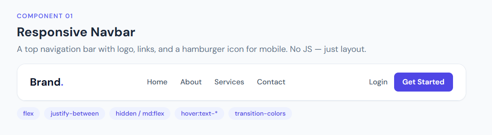
---

### 02 — Simple Card

Build a basic card with a cover image, category label, title, short description, and a full-width CTA button at the bottom. Image should use `object-cover` so it doesn't distort.

**Utility focus:** `rounded-2xl`, `overflow-hidden`, `object-cover`, `shadow-sm`, `w-full`, `p-5`, `leading-relaxed`

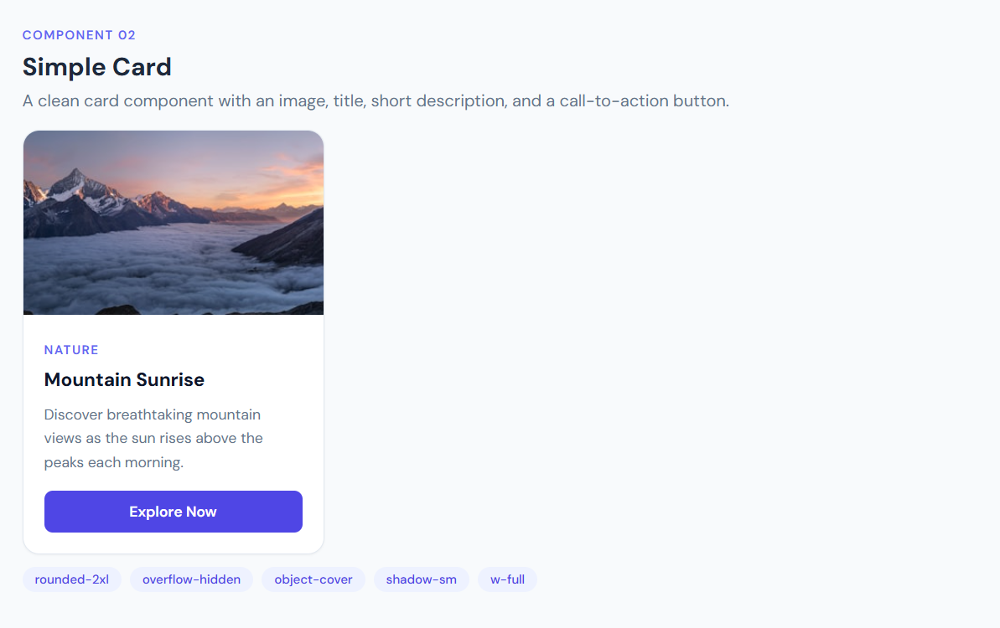
---

### 03 — Button Variants

Build a set of 6 button styles side by side — Primary, Secondary, Outline, Ghost, Danger, and Disabled. Each button should have hover state and proper padding.

**Utility focus:** `border-2`, `cursor-not-allowed`, `hover:bg-*`, `transition-colors`, `flex-wrap`, `gap-3`, `opacity-*`

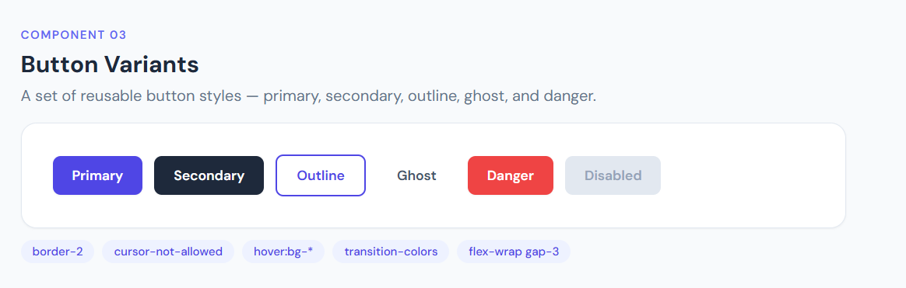
---

### 04 — User Profile Card

Build a profile card with a gradient cover strip at the top, an avatar overlapping the cover using negative margin, user name, role, follower stats row, and two action buttons side by side.

**Utility focus:** `-mt-10` (negative margin), `bg-gradient-to-r`, `border-4 border-white`, `flex-1`, `rounded-full`

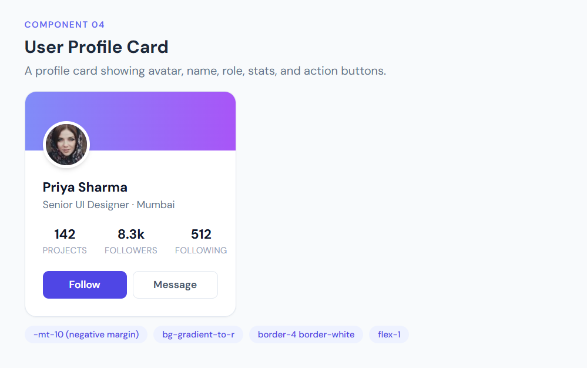
---

### 05 — Alert Boxes

Build 4 alert banners — Success, Error, Warning, Info — each with a colored background, matching border, an SVG icon, and a title + message inside.

**Utility focus:** `bg-green-50`, `border-green-200`, `flex items-start gap-3`, `flex-shrink-0`, `space-y-3`, `text-green-800`

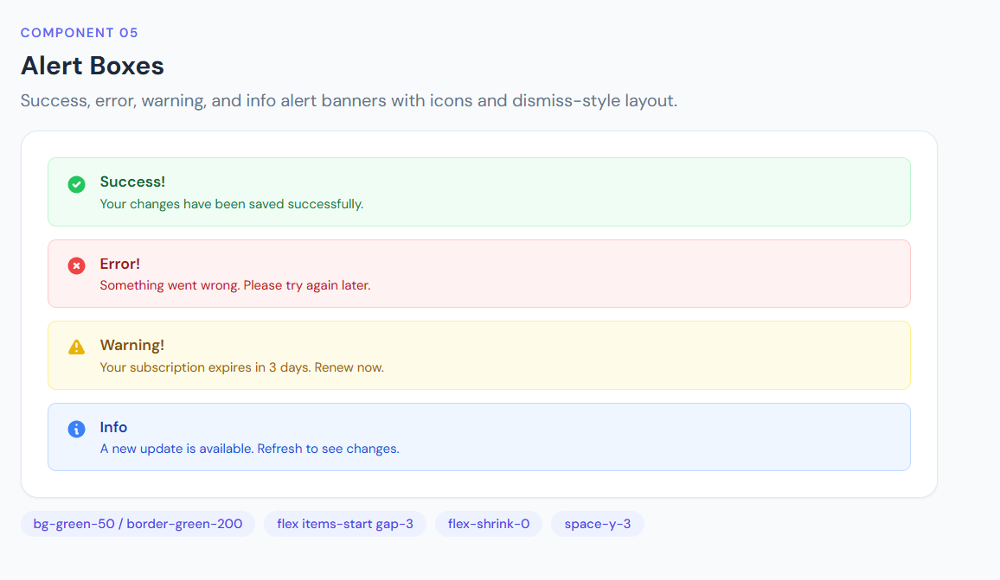
---

### 06 — Pricing Card

Build a dark "Pro Plan" pricing card with the plan name, price, a features list with checkmarks, one crossed-out feature, and a CTA button at the bottom.

**Utility focus:** `bg-slate-900`, `border-b border-slate-700`, `space-y-3`, `line-through`, `text-indigo-400`, `rounded-xl`

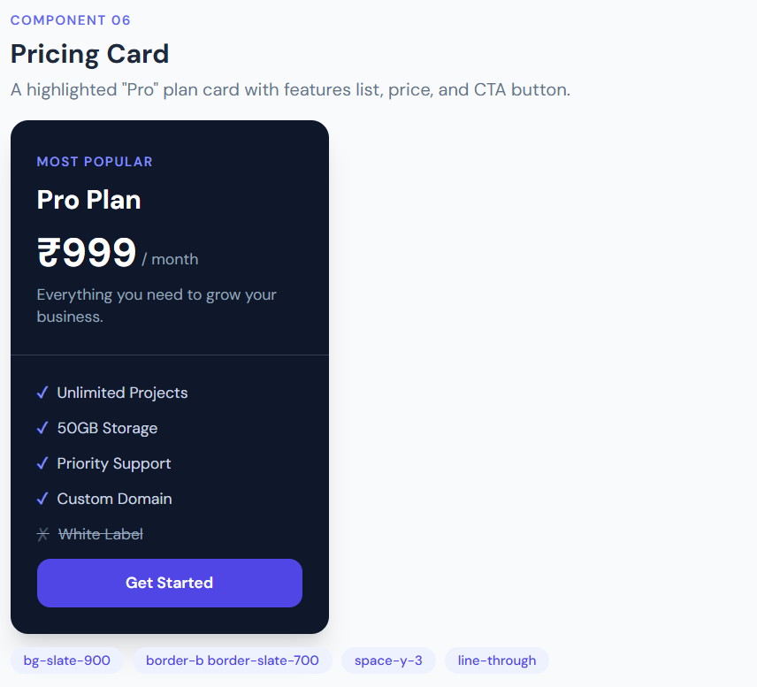
---

### 07 — Testimonial Card

Build a customer review card with 5 star icons, a quote paragraph, and an author section at the bottom with avatar, name, and designation.

**Utility focus:** `leading-relaxed`, `text-yellow-400`, `flex items-center gap-3`, `max-w-md`, `rounded-full`, `text-sm`

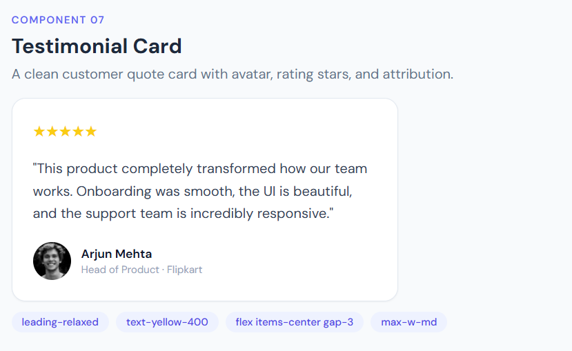
---

### 08 — Login Form

Build a clean login form with email and password input fields, a "Forgot password?" link aligned to the right, and a Sign In button. Add focus ring styles on the inputs.

**Utility focus:** `focus:ring-2`, `focus:ring-indigo-500`, `focus:outline-none`, `placeholder-slate-400`, `space-y-4`, `justify-between`

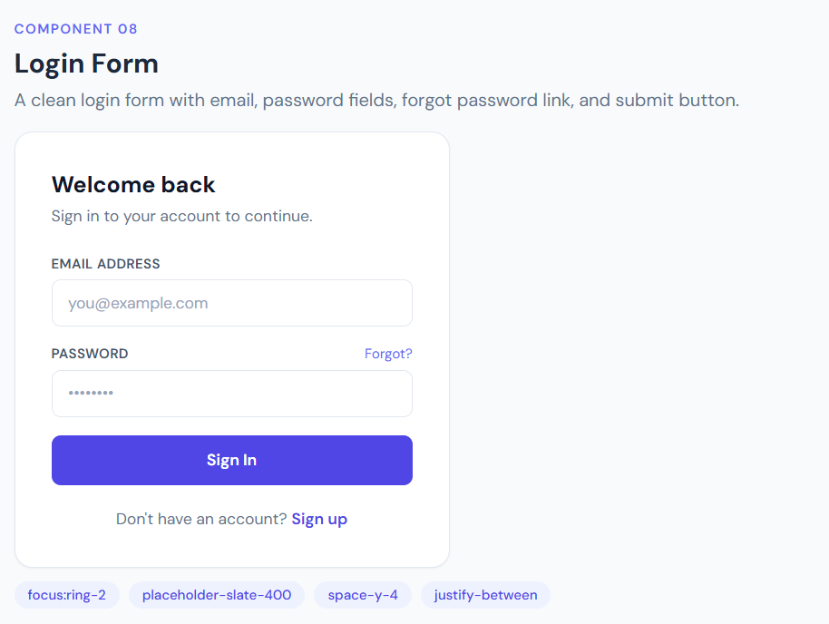
---

### 09 — Sidebar Navigation

Build a dark vertical sidebar with a logo at the top, nav links with icons (one active, rest with hover states), and a logout link pinned to the bottom in red.

**Utility focus:** `flex flex-col`, `flex-1`, `hover:bg-slate-800`, `bg-indigo-600` (active state), `gap-1`, `rounded-lg`, `transition-colors`

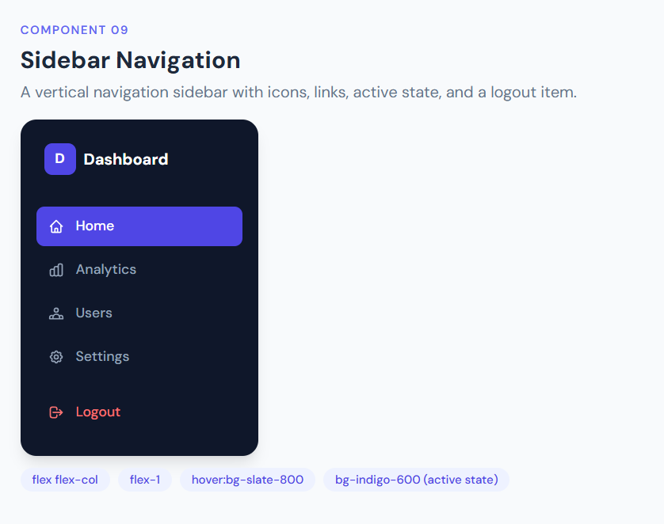
---

### 10 — Product Card

Build an e-commerce product card with an image, a "−20%" discount badge overlaid using absolute positioning, product name, star rating, original + discounted price, and an Add to Cart button.

**Utility focus:** `relative`, `absolute top-3 left-3`, `line-through`, `justify-between`, `object-cover`, `rounded-full` (badge)

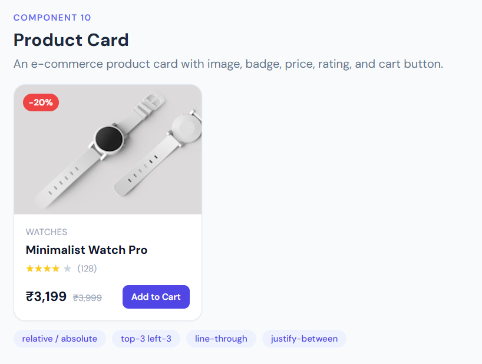
---

### 11 — Hero Section

Build a dark full-width hero with a small pill label at the top, a large headline with a colored accent word, a subtitle, and two CTA buttons — one filled and one outline.

**Utility focus:** `text-center`, `bg-indigo-500/20` (tinted badge), `max-w-2xl mx-auto`, `leading-tight`, `flex-wrap justify-center`, `rounded-xl`

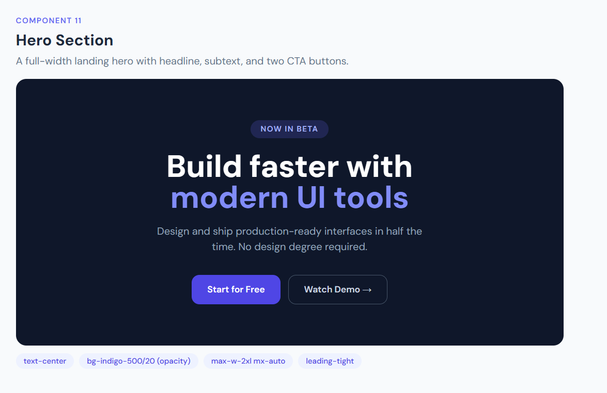
---

### 12 — Notification Dropdown

Build a static notification panel with a header showing unread count, a list of 4 notifications (2 unread, 2 read), each with avatar/icon, message text, timestamp, and a blue dot for unread ones.

**Utility focus:** `divide-y`, `bg-indigo-50/50`, `flex-shrink-0`, `w-2 h-2 rounded-full` (unread dot), `flex items-start gap-3`

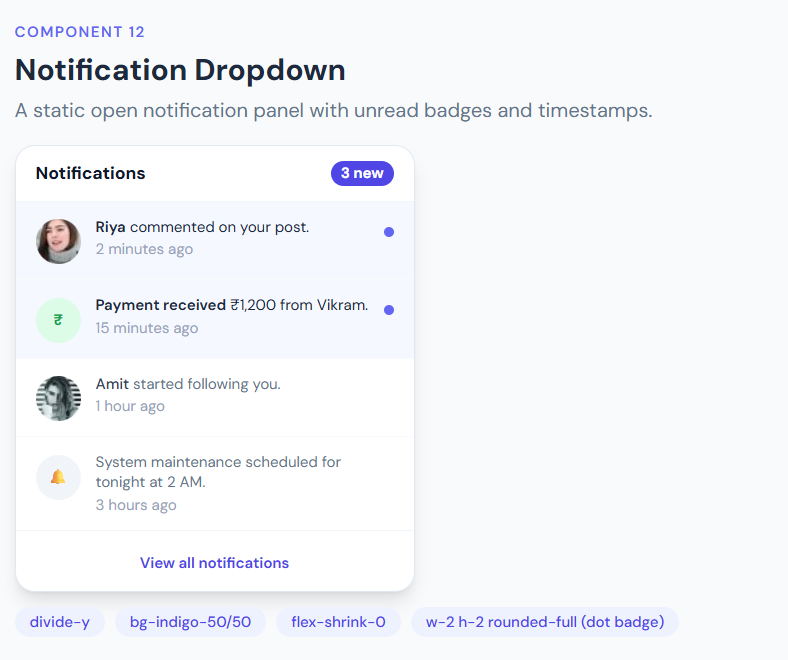
---

### 13 — Stats Section

Build a metrics row with 4 stat blocks — each showing a label, a large number, and a trend indicator (green for up, red for down). Use `border-r` between blocks and `last:border-0` to remove the last one.

**Utility focus:** `flex-wrap`, `flex-1 min-w-32`, `border-r`, `last:border-0`, `text-3xl font-bold`, `text-green-500`, `text-red-500`

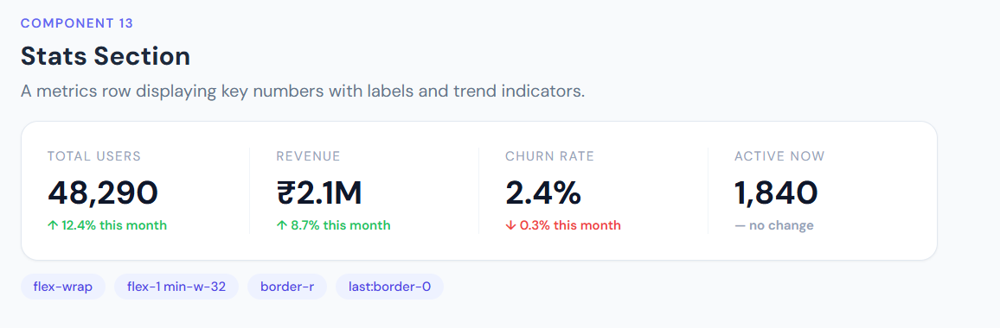
---

### 14 — Footer Section

Build a dark multi-column footer with a brand description on the left and 3 link columns (Product, Company, Legal) on the right. Add a bottom bar with copyright text and social links.

**Utility focus:** `flex flex-wrap gap-10`, `justify-between`, `flex-col gap-2`, `border-t border-slate-800`, `hover:text-white`, `transition-colors`

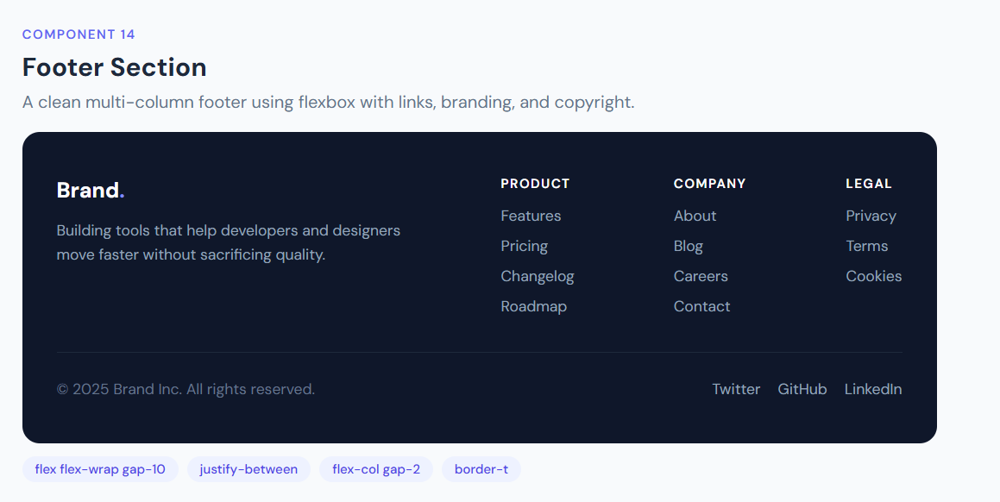
---

### 15 — Blog Card

Build a blog post card with a cover image, category pill badge, article title that changes color on hover, description text, and an author row with avatar, name, and date aligned on opposite ends.

**Utility focus:** `hover:shadow-md`, `transition-shadow`, `bg-indigo-100 text-indigo-600` (pill), `justify-between`, `leading-relaxed`, `cursor-pointer`

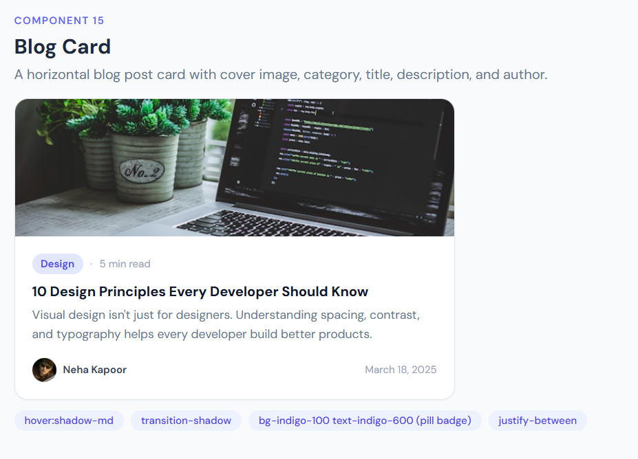
---

### 16 — Chat UI

Build a chat window with a header showing online status, a message area with left-aligned received messages and right-aligned sent messages using `justify-end`, and a message input with a send button at the bottom.

**Utility focus:** `justify-end` (sent messages), `rounded-bl-sm` / `rounded-br-sm` (bubble tails), `max-w-[75%]`, `rounded-full`, `space-y-3`, `bg-slate-50`

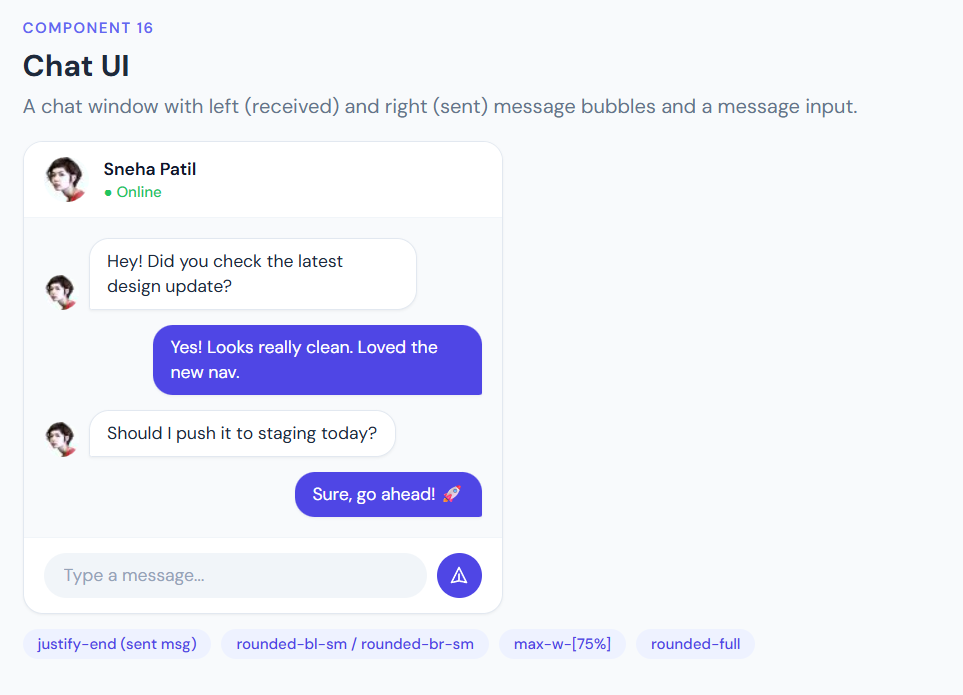
---

### 17 — Admin Header Bar

Build a top admin bar with a page title + date on the left, and a search box, notification bell with a red badge dot, and a profile block on the right. Search and profile hide on mobile.

**Utility focus:** `hidden sm:flex`, `relative` (bell badge), `absolute top-1 right-1` (red dot), `bg-transparent` (search input), `justify-between gap-4`

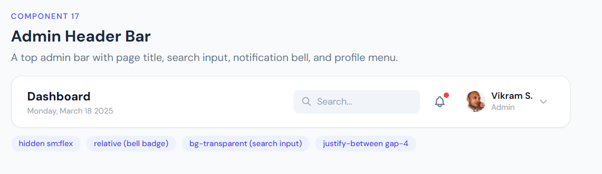
---

### 18 — Profile Settings Form

Build a settings panel with a change photo section, two side-by-side name fields, an email field, a bio textarea, and Save + Cancel buttons at the bottom.

**Utility focus:** `flex flex-wrap gap-4`, `flex-1 min-w-36`, `resize-none`, `focus:ring-2 focus:ring-indigo-500`, `space-y-4`, `focus:border-transparent`

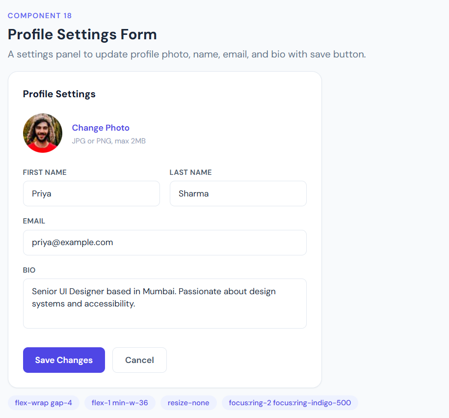
---

### 19 — Contact Form

Build a contact form with a colored header strip at the top (name + subtitle), and fields below for name, email, subject, message, and a full-width submit button.

**Utility focus:** `overflow-hidden`, `bg-indigo-600` (header strip), `text-indigo-200`, `space-y-4`, `flex-1 min-w-36`, `resize-none`, `rounded-lg`

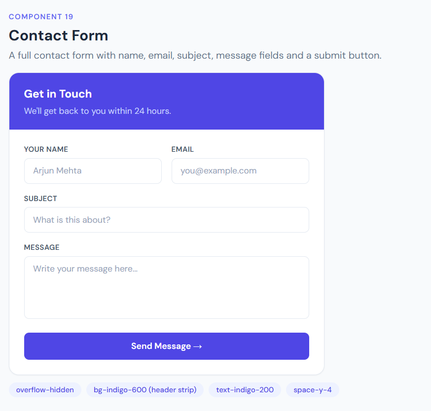
---

### 20 — Dashboard Summary Cards

Build 4 stat cards side by side using `flex-wrap` — each with a label, a colored icon box on the right, a large metric number, and a trend line below. No grid — only flex.

**Utility focus:** `flex flex-wrap gap-4`, `flex-1 min-w-44`, `justify-between` (icon row), `bg-indigo-50` (icon bg), `text-2xl font-bold`, `rounded-lg`

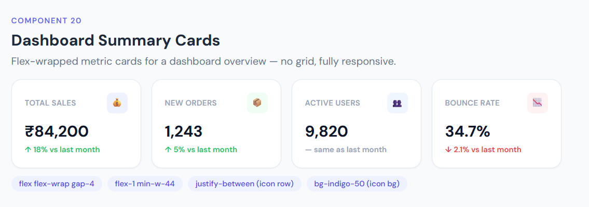

---

## Note

This section includes only the basic projects so you can start building and practice utility classes confidently.

After this, we will move to more advanced projects like:

- A complete landing page
- A full dashboard
- An e-commerce product page
- And more

Keep practicing and building. Tailwind CSS is best learned by doing, and the more you build, the more comfortable you become with combining utility classes effectively.